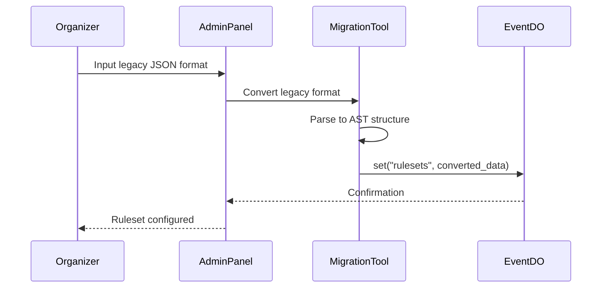
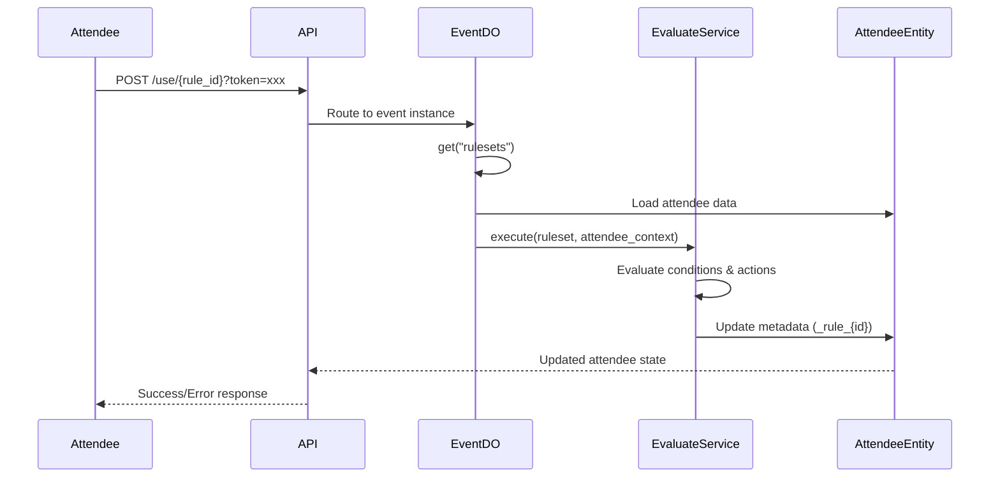
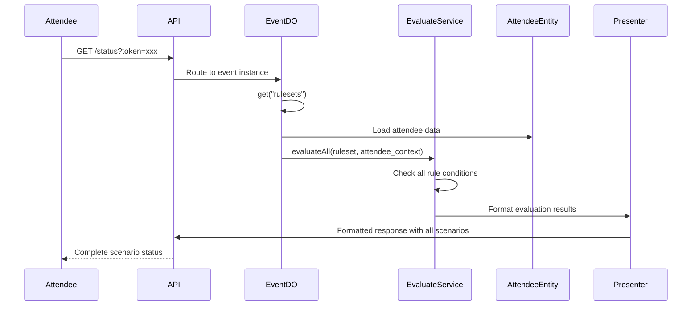

# Ruleset System Design

## Overview

The Ruleset System is a flexible rule engine designed to manage event attendee interactions and resource allocation. It enables event organizers to create configurable rules that control what attendees can do, when they can do it, and how many times actions can be performed.

### Core Purpose

The system addresses common event management challenges:
- **Resource Control**: Prevent attendees from taking multiple lunch boxes, welcome kits, or other limited resources
- **Progressive Unlocking**: Create structured experiences where completing one action unlocks others (e.g., check-in before meal collection)
- **Role-Based Access**: Different attendee types (audience, speakers, staff) have different available actions
- **Conditional Logic**: Actions can be shown/hidden or enabled/disabled based on attendee attributes or previous actions

### Key Features

- **State Tracking**: Track when attendees perform actions to prevent duplicates
- **Conditional Visibility**: Rules can be shown/hidden based on attendee metadata or role
- **Dynamic Unlocking**: Actions can unlock other actions, creating workflow chains
- **Metadata Integration**: Attendee-specific information can be attached to actions (e.g., dietary preferences for meals)
- **Multi-language Support**: All display text supports internationalization
- **Time-based Availability**: Rules can have specific time windows for availability

### Real-World Examples

- **Meal Distribution**: "Lunch Box Collection" rule prevents taking multiple boxes, shows dietary information
- **Check-in Flow**: "Event Check-in" unlocks "Welcome Kit Collection" and "Networking Session Access"
- **Speaker Perks**: "Speaker Lounge Access" only visible to attendees with speaker role
- **Conditional Resources**: "Vegetarian Meal" only shown to attendees who specified dietary preferences

The system replaces hardcoded event logic with a flexible, configurable rule engine that can adapt to different event types and requirements.

## User Stories

### Resource Control
```gherkin
Feature: Meal Collection Control
  As an event organizer
  I want to prevent attendees from collecting multiple lunch boxes
  So that we have enough meals for everyone

  Scenario: Attendee collects lunch box for first time
    Given I am an attendee with a valid token
    And the "lunch_collection" rule is available
    When I use the lunch collection service
    Then my lunch box is marked as collected
    And I cannot collect another lunch box

  Scenario: Attendee tries to collect lunch box again
    Given I have already collected my lunch box
    When I try to use the lunch collection service again
    Then I should receive an error "already collected"
    And no additional lunch box is distributed
```

### Progressive Unlocking
```gherkin
Feature: Check-in Workflow
  As an event organizer
  I want attendees to check-in before accessing other services
  So that we can track attendance and control access

  Scenario: Attendee completes check-in process
    Given I am an attendee who hasn't checked in
    When I complete the event check-in
    Then my check-in is recorded
    And "welcome_kit" collection becomes available
    And "networking_session" access becomes available

  Scenario: Attendee tries to access services without check-in
    Given I haven't completed check-in yet
    When I try to collect my welcome kit
    Then I should receive an error "check-in required"
    And the welcome kit remains unavailable
```

### Role-Based Access
```gherkin
Feature: Speaker-Only Resources
  As an event organizer
  I want certain resources to be available only to speakers
  So that we can provide appropriate perks for different attendee types

  Scenario: Speaker accesses speaker lounge
    Given I am an attendee with "speaker" role
    When I view my available services
    Then I should see "speaker_lounge_access" option
    And I can use the speaker lounge service

  Scenario: Regular attendee cannot access speaker resources
    Given I am an attendee with "audience" role
    When I view my available services
    Then I should not see "speaker_lounge_access" option
    And I cannot access speaker-only resources
```

### Conditional Metadata Integration
```gherkin
Feature: Dietary Preference Meals
  As an event organizer
  I want to provide appropriate meals based on attendee dietary preferences
  So that everyone receives suitable food options

  Scenario: Vegetarian attendee sees vegetarian meal option
    Given I have dietary preference "vegetarian" in my profile
    When I view available meal options
    Then I should see "vegetarian_meal" collection option
    And the meal details should show "Vegetarian Option"

  Scenario: Attendee with no dietary restrictions sees standard meal
    Given I have no special dietary preferences
    When I view available meal options
    Then I should see "standard_meal" collection option
    And I should not see specialized meal options
```

## Workflow (with Diagram)

### Workflow 1: Config Ruleset (Organizer)

Organizers can add rulesets through an admin panel. The system supports legacy format conversion to maintain backward compatibility with existing test cases.

```
Legacy JSON Input → Migration Tool → AST Conversion → Event DO KV Storage
```

**Steps:**
1. Admin panel provides migration tool interface
2. Organizer inputs legacy scenario JSON format
3. Migration tool converts to AST-based structure
4. Store in Event's Durable Object KV: `eventDO.set("rulesets", { "audience": [AST...], "speaker": [AST...] })`
5. Test cases use same migration tool for setup



### Workflow 2: Use Ruleset (Attendee Action)

Attendees can execute specific rules through the use endpoint. The system evaluates conditions and updates attendee state accordingly.

```
Action Request → Load from Event DO KV → Load Attendee → Evaluate → Update Metadata → Return Result
```

**Steps:**
1. Attendee makes `/use/{rule_id}` request with token
2. Route to appropriate Event Durable Object
3. Load rulesets from KV: `eventDO.get("rulesets")`
4. Find ruleset by attendee role
5. Load Attendee entity with current metadata
6. `EvaluateService.execute(ruleset, attendee_context)`
7. Update attendee metadata: `_rule_{id}` timestamp
8. Return success/error result



### Workflow 3: Display Scenario (Status Check)

The status endpoint evaluates all applicable rules for an attendee and returns the complete scenario state including visibility, availability, and usage status.

```
Status Request → Load from Event DO KV → Load Attendee → Evaluate All → Format Response
```

**Steps:**
1. Attendee makes `/status` request with token
2. Route to appropriate Event Durable Object
3. Load rulesets from KV: `eventDO.get("rulesets")`
4. Find ruleset by attendee role
5. Load Attendee entity with current metadata
6. `EvaluateService.evaluateAll(ruleset, attendee_context)` - check visibility, availability, usage status
7. Format into API response with all rule states
8. Return complete scenario display




## Domain Model

The domain model uses Clean Architecture principles with an aggregate root pattern. It leverages Strategy and Composite patterns for flexible rule evaluation.

### Aggregate Root - Ruleset

The `Ruleset` is the aggregate root that manages a collection of rules. It provides the entry point for rule evaluation and ensures consistency across the rule collection.

```typescript
export class Ruleset {
  constructor(
    private readonly rules: Map<string, Rule>
  ) {}

  getRule(id: string): Rule | null {
    return this.rules.get(id) || null
  }

  evaluate(context: EvaluationContext): Map<string, Rule> {
    const availableRules = new Map<string, Rule>()
    this.rules.forEach((rule, id) => {
      if (rule.isVisible(context)) {
        availableRules.set(id, rule)
      }
    })
    return availableRules
  }
}
```

### Core Entity - Rule

A `Rule` represents a single action or resource that attendees can access. It encapsulates all the logic for visibility, usability, and execution.

```typescript
export class Rule {
  constructor(
    public readonly id: string,
    public readonly order: number,
    public readonly messages: Map<string, I18nText>, // Message ID -> I18nText
    public readonly timeWindow: TimeWindow,
    public readonly showCondition: ConditionNode,
    public readonly unlockCondition: ConditionNode,
    public readonly actions: ActionNode[],
    public readonly metadataMapping: MetadataMapping
  ) {}

  getMessage(messageId: string): I18nText | null {
    return this.messages.get(messageId) || null
  }

  isVisible(context: EvaluationContext): boolean {
    return this.showCondition.evaluate(context)
  }

  isUsable(context: EvaluationContext): boolean {
    return this.unlockCondition.evaluate(context) &&
           !this.isAlreadyUsed(context) &&
           this.timeWindow.isAvailable(context.currentTime)
  }

  apply(context: ExecutionContext): void {
    if (!this.isVisible(context) || !this.isUsable(context)) {
      throw new Error("Cannot apply rule")
    }

    this.actions.forEach(action => action.execute(context))
  }

  private isAlreadyUsed(context: EvaluationContext): boolean {
    return context.attendee.hasUsedRule(this.id)
  }
}
```

### Condition Nodes (Strategy + Composite Pattern)

Conditions form an Abstract Syntax Tree (AST) that can be evaluated to determine rule visibility and usability.

#### Base Condition
```typescript
export abstract class ConditionNode {
  abstract evaluate(context: EvaluationContext): boolean
}
```

#### Leaf Conditions

**AttributeCondition**: Checks if an attendee attribute matches an expected value.
```typescript
export class AttributeCondition extends ConditionNode {
  constructor(
    private readonly attributeKey: string,
    private readonly expectedValue: string
  ) {}

  evaluate(context: EvaluationContext): boolean {
    return context.attendee.getMetadata(this.attributeKey) === this.expectedValue
  }
}
```

**UsedRuleCondition**: Checks if another rule has been used.
```typescript
export class UsedRuleCondition extends ConditionNode {
  constructor(private readonly ruleId: string) {}

  evaluate(context: EvaluationContext): boolean {
    return context.attendee.hasUsedRule(this.ruleId)
  }
}
```

**AlwaysTrueCondition**: A condition that always evaluates to true (for rules without conditions).
```typescript
export class AlwaysTrueCondition extends ConditionNode {
  evaluate(context: EvaluationContext): boolean {
    return true
  }
}
```

**RoleCondition**: Checks if attendee has one of the allowed roles.
```typescript
export class RoleCondition extends ConditionNode {
  constructor(private readonly allowedRoles: string[]) {}

  evaluate(context: EvaluationContext): boolean {
    return this.allowedRoles.includes(context.attendee.role)
  }
}
```

**StaffCondition**: Checks if the query is in staff mode.
```typescript
export class StaffCondition extends ConditionNode {
  constructor(private readonly shouldBeStaff: boolean = true) {}

  evaluate(context: EvaluationContext): boolean {
    return context.isStaffQuery === this.shouldBeStaff
  }
}
```

#### Composite Conditions

**AndCondition**: All child conditions must be true.
```typescript
export class AndCondition extends ConditionNode {
  constructor(private readonly children: ConditionNode[]) {}

  evaluate(context: EvaluationContext): boolean {
    return this.children.every(child => child.evaluate(context))
  }
}
```

**OrCondition**: At least one child condition must be true.
```typescript
export class OrCondition extends ConditionNode {
  constructor(private readonly children: ConditionNode[]) {}

  evaluate(context: EvaluationContext): boolean {
    return this.children.some(child => child.evaluate(context))
  }
}
```

### Action Nodes (Strategy Pattern)

Actions are executed when a rule is applied successfully.

#### Base Action
```typescript
export abstract class ActionNode {
  abstract execute(context: ExecutionContext): void
}
```

#### Concrete Actions

**MarkUsedAction**: Marks a rule as used by storing a timestamp in attendee metadata.
```typescript
export class MarkUsedAction extends ActionNode {
  constructor(private readonly ruleId: string) {}

  execute(context: ExecutionContext): void {
    const timestamp = Math.floor(context.currentTime.getTime() / 1000)
    context.attendee.setMetadata(`_rule_${this.ruleId}`, timestamp.toString())
  }
}
```

### Supporting Value Objects

#### TimeWindow

Represents the availability period for a rule.
```typescript
export class TimeWindow {
  constructor(
    public readonly start: Date,
    public readonly end: Date
  ) {}

  isAvailable(current: Date): boolean {
    return current >= this.start && current <= this.end
  }
}
```

#### I18nText

Handles internationalized text with fallback support.
```typescript
export class I18nText {
  constructor(private readonly translations: Map<string, string>) {}

  getText(locale: string): string {
    return this.translations.get(locale) ||
           this.translations.get('en-US') ||
           ''
  }
}
```

#### MetadataMapping

Maps attendee metadata to rule-specific display attributes for API responses.
```typescript
export class MetadataMapping {
  constructor(private readonly mappings: Map<string, string>) {}

  // Maps attendee metadata to scenario display format
  // e.g. attendee.metadata["飲食"] -> scenario.attr["diet"]
  applyToDisplay(attendeeMetadata: Map<string, any>): Map<string, any> {
    const result = new Map<string, any>()
    this.mappings.forEach((attendeeKey, displayKey) => {
      if (attendeeMetadata.has(attendeeKey)) {
        result.set(displayKey, attendeeMetadata.get(attendeeKey))
      }
    })
    return result
  }
}
```

### Contexts

#### EvaluationContext

Provides the context needed for evaluating rule conditions.
```typescript
export class EvaluationContext {
  constructor(
    public readonly attendee: Attendee,
    public readonly currentTime: Date,
    public readonly isStaffQuery: boolean = false
  ) {}
}
```

#### ExecutionContext

Provides the context needed for executing rule actions.
```typescript
export class ExecutionContext {
  constructor(
    public readonly attendee: Attendee,
    public readonly currentTime: Date
  ) {}
}
```

### Design Patterns Summary

- **Aggregate Pattern**: `Ruleset` as the aggregate root managing `Rule` entities
- **Strategy Pattern**: Different condition types (`AttributeCondition`, `UsedRuleCondition`, `RoleCondition`, `StaffCondition`) and action types (`MarkUsedAction`)
- **Composite Pattern**: `AndCondition` and `OrCondition` containing child conditions
- **Value Object Pattern**: Immutable objects (`TimeWindow`, `I18nText`, `MetadataMapping`) for data integrity

## Schema

The ruleset system stores all configuration in the Event Durable Object's KV storage. Each event has its own isolated storage instance.

### KV Storage Structure

Rulesets are stored under a single key for atomic updates:

```typescript
durableObject.set("rulesets", { /* ruleset data */ })
```

### Ruleset Schema

The top-level structure organizes rulesets by attendee role:

```json
{
  "audience": {
    "version": "1.0",
    "rules": [
      {
        "id": "checkin",
        "order": 0,
        "messages": {
          "display": {
            "en-US": "Check-in",
            "zh-TW": "報到"
          },
          "locked": {
            "en-US": "Check-in is not available",
            "zh-TW": "報到尚未開放"
          },
          "staff_locked": {
            "en-US": "Staff query mode - cannot use",
            "zh-TW": "工作人員查詢模式 - 無法使用"
          },
          "expired": {
            "en-US": "Check-in period has ended",
            "zh-TW": "報到時間已結束"
          },
          "already_used": {
            "en-US": "Already checked in",
            "zh-TW": "已完成報到"
          }
        },
        "timeWindow": {
          "start": "2023-08-26T00:00:00Z",
          "end": "2023-09-26T00:00:00Z"
        },
        "conditions": {
          "show": { "type": "AlwaysTrue" },
          "unlock": { "type": "AlwaysTrue" }
        },
        "actions": [
          { "type": "MarkUsed", "ruleId": "checkin" }
        ],
        "metadata": {}
      },
      {
        "id": "welcome_kit",
        "order": 1,
        "messages": {
          "display": {
            "en-US": "Welcome Kit",
            "zh-TW": "迎賓袋"
          },
          "locked": {
            "en-US": "Please check-in first",
            "zh-TW": "請先完成報到"
          }
        },
        "timeWindow": {
          "start": "2023-08-26T00:00:00Z",
          "end": "2023-09-26T00:00:00Z"
        },
        "conditions": {
          "show": { "type": "AlwaysTrue" },
          "unlock": { "type": "UsedRule", "ruleId": "checkin" }
        },
        "actions": [
          { "type": "MarkUsed", "ruleId": "welcome_kit" }
        ],
        "metadata": {}
      }
    ]
  },
  "speaker": {
    "version": "1.0",
    "rules": [/* speaker-specific rules */]
  },
  "staff": {
    "version": "1.0",
    "rules": [/* staff-specific rules */]
  }
}
```

### Rule Schema

Each rule contains:

| Field        | Type   | Description                                  |
|--------------|--------|----------------------------------------------|
| `id`         | string | Unique identifier for the rule               |
| `order`      | number | Display order (lower numbers appear first)   |
| `messages`   | object | Map of message IDs to internationalized text |
| `timeWindow` | object | Availability period with start/end dates     |
| `conditions` | object | Show and unlock conditions                   |
| `actions`    | array  | Actions to execute when rule is used         |
| `metadata`   | object | Metadata mapping configuration               |

### Condition AST Schema

Conditions use a polymorphic structure with a `type` field:

#### Leaf Conditions

```json
// Always true (no conditions)
{ "type": "AlwaysTrue" }

// Check attendee attribute
{
  "type": "Attribute",
  "key": "個人贊助",
  "value": "Y"
}

// Check if another rule was used
{
  "type": "UsedRule",
  "ruleId": "checkin"
}

// Check attendee role
{
  "type": "Role",
  "allowedRoles": ["audience", "speaker"]
}

// Check staff query mode
{
  "type": "Staff",
  "shouldBeStaff": false  // true = only in staff mode, false = only in normal mode
}
```

#### Composite Conditions

```json
// All conditions must be true
{
  "type": "And",
  "children": [
    { "type": "Attribute", "key": "tier", "value": "VIP" },
    { "type": "UsedRule", "ruleId": "checkin" }
  ]
}

// At least one condition must be true
{
  "type": "Or",
  "children": [
    { "type": "Attribute", "key": "early_bird", "value": "true" },
    { "type": "Attribute", "key": "tier", "value": "VIP" }
  ]
}
```

### Action AST Schema

Actions use the same polymorphic structure:

```json
// Mark rule as used
{
  "type": "MarkUsed",
  "ruleId": "checkin"
}
```

Future action types can be added:
```json
// Examples of potential future actions
{ "type": "SendNotification", "template": "welcome" }
{ "type": "GrantBadge", "badgeId": "early_bird" }
{ "type": "AddPoints", "amount": 100 }
```

### Metadata Mapping Schema

Maps attendee attributes to rule-specific display attributes:

```json
{
  "metadata": {
    "diet": { "key": "飲食" },
    "allergies": { "key": "過敏原" }
  }
}
```

This maps:
- `attendee.metadata["飲食"]` → `scenario.attr["diet"]`
- `attendee.metadata["過敏原"]` → `scenario.attr["allergies"]`

### Schema Design Principles

1. **Single KV Entry**: All rulesets stored under one key for atomic updates
2. **Role-based Organization**: Separate rulesets by attendee role for clarity
3. **Version Field**: Support future schema migrations at the role level
4. **Flat AST Structure**: Use `type` field for polymorphic nodes instead of deep nesting
5. **ISO Date Format**: Store times as ISO 8601 strings for JSON compatibility
6. **Extensibility**: New condition and action types can be added without breaking existing data

## Technology Details

### AST Parser Implementation

The parser converts JSON schema to domain objects using a factory pattern:

```typescript
export class ConditionNodeFactory {
  static create(json: any): ConditionNode {
    switch (json.type) {
      case 'AlwaysTrue':
        return new AlwaysTrueCondition()
      case 'Attribute':
        return new AttributeCondition(json.key, json.value)
      case 'UsedRule':
        return new UsedRuleCondition(json.ruleId)
      case 'Role':
        return new RoleCondition(json.allowedRoles)
      case 'Staff':
        return new StaffCondition(json.shouldBeStaff)
      case 'And':
        return new AndCondition(
          json.children.map(child => ConditionNodeFactory.create(child))
        )
      case 'Or':
        return new OrCondition(
          json.children.map(child => ConditionNodeFactory.create(child))
        )
      default:
        throw new Error(`Unknown condition type: ${json.type}`)
    }
  }
}

export class ActionNodeFactory {
  static create(json: any): ActionNode {
    switch (json.type) {
      case 'MarkUsed':
        return new MarkUsedAction(json.ruleId)
      // TODO: Add more action types as needed
      default:
        throw new Error(`Unknown action type: ${json.type}`)
    }
  }
}
```

### Migration Tool

Converts legacy scenario format to new AST-based ruleset format:

```typescript
export class LegacyMigrationTool {
  static migrate(legacyScenarios: any): RulesetJson {
    // TODO: Implement conversion logic
    // - Convert available_time to timeWindow
    // - Convert conditions.show to showCondition AST
    // - Convert conditions.unlock to unlockCondition AST
    // - Generate default actions (MarkUsed)
    // - Handle metadata mappings

    // Note: Admin panel integration will be supported in future
  }

  static validate(ruleset: RulesetJson): ValidationResult {
    // TODO: Validate converted AST structure
    // - Check all required fields
    // - Validate condition references
    // - Ensure action consistency
  }
}
```

### Repository Interface

```typescript
export interface RulesetRepository {
  load(): Promise<Map<string, Ruleset>>
  save(rulesets: Map<string, Ruleset>): Promise<void>
  update(role: string, ruleset: Ruleset): Promise<void>
}

@injectable()
export class DurableObjectRulesetRepository implements RulesetRepository {
  constructor(
    @inject(DatabaseConnectionToken)
    private readonly connection: IDatabaseConnection
  ) {}

  async load(): Promise<Map<string, Ruleset>> {
    const data = await this.connection.get("rulesets")
    if (!data) return new Map()

    // TODO: Parse JSON and create Ruleset domain objects
    // - Use ConditionNodeFactory for conditions
    // - Use ActionNodeFactory for actions
    // - Build Rule and Ruleset entities
  }

  async save(rulesets: Map<string, Ruleset>): Promise<void> {
    // TODO: Convert domain objects to JSON
    // TODO: Save to Durable Object KV storage
  }
}
```

### Use Case Implementation

```typescript
// Query for displaying available rules
export class GetAvailableRulesQuery {
  constructor(
    private readonly repository: RulesetRepository,
    private readonly presenter: RuleListPresenter
  ) {}

  async execute(attendee: Attendee, currentTime: Date): Promise<void> {
    const rulesets = await this.repository.load()
    const roleRuleset = rulesets.get(attendee.role)

    if (!roleRuleset) {
      this.presenter.presentEmpty()
      return
    }

    const context = new EvaluationContext(attendee, currentTime)
    const availableRules = roleRuleset.evaluate(context)

    // TODO: Format rules for display
    // - Check usability status
    // - Apply metadata mappings
    // - Sort by order

    availableRules.forEach((rule, id) => {
      this.presenter.addRule(/* formatted rule data */)
    })
  }
}

// Command for using a rule
export class UseRuleCommand {
  constructor(
    private readonly repository: RulesetRepository,
    private readonly attendeeRepository: AttendeeRepository
  ) {}

  async execute(attendeeToken: string, ruleId: string): Promise<void> {
    // TODO: Load attendee
    // TODO: Load ruleset
    // TODO: Find and validate rule
    // TODO: Apply rule actions
    // TODO: Save attendee state
  }
}
```

### Service Layer

```typescript
@injectable()
export class RuleEvaluationService {
  evaluate(ruleset: Ruleset, context: EvaluationContext): Map<string, RuleStatus> {
    // TODO: Evaluate all rules in ruleset
    // TODO: Return status map with visibility/usability info
  }

  evaluateRule(rule: Rule, context: EvaluationContext): RuleStatus {
    return {
      visible: rule.isVisible(context),
      usable: rule.isUsable(context),
      used: context.attendee.hasUsedRule(rule.id),
      // TODO: Add more status fields
    }
  }
}

@injectable()
export class DatetimeService implements IDatetimeService {
  getCurrentTime(): Date {
    // Check if we're in test mode and return mock datetime
    if (env.__TEST__ === "true" && env.__MOCK_DATETIME__) {
      return new Date(env.__MOCK_DATETIME__)
    }
    return new Date()
  }
}
```

### API Integration

```typescript
// Status endpoint controller
export class StatusController extends OpenAPIRoute {
  schema = {
    // TODO: Define OpenAPI schema
  }

  async handle(c: Context<{ Bindings: Env }>) {
    const token = c.req.query('token')

    // Resolve dependencies
    const repository = container.resolve<RulesetRepository>(RulesetRepositoryToken)
    const presenter = new JsonRuleListPresenter()

    // Execute query
    const query = new GetAvailableRulesQuery(repository, presenter)
    await query.execute(attendee, currentTime)

    return c.json(presenter.toJson())
  }
}

// Use rule endpoint controller
export class UseRuleController extends OpenAPIRoute {
  schema = {
    // TODO: Define OpenAPI schema
  }

  async handle(c: Context<{ Bindings: Env }>) {
    const { ruleId } = c.req.param()
    const token = c.req.query('token')

    try {
      // TODO: Execute UseRuleCommand
      return c.json({ success: true })
    } catch (error) {
      return c.json({ message: error.message }, 400)
    }
  }
}
```

### Testing Strategy

```typescript
// BDD step definition
Given('there have a ruleset for {string} with name {string} and scenarios:',
  async function(event: string, role: string, scenariosJson: string) {
    // TODO: Parse legacy format
    // TODO: Convert to new ruleset format
    // TODO: Store in test database
  }
)

// Unit test example
describe('AndCondition', () => {
  it('should return true when all children are true', () => {
    const condition = new AndCondition([
      new AlwaysTrueCondition(),
      new AlwaysTrueCondition()
    ])

    const context = new EvaluationContext(attendee, new Date())
    expect(condition.evaluate(context)).toBe(true)
  })

  // TODO: Add more test cases
})
```

### Performance Considerations

```typescript
// KV Storage Optimization
class CachedRulesetRepository implements RulesetRepository {
  private cache: Map<string, Ruleset> | null = null

  async load(): Promise<Map<string, Ruleset>> {
    if (this.cache) return this.cache

    // TODO: Load from KV and cache
    // TODO: Implement cache invalidation strategy
  }
}

// Concurrent Request Handling
// Durable Objects handle concurrency automatically
// Each event has isolated storage and processing
```

## Example Usage

### Basic Check-in Flow

```typescript
// 1. Configure ruleset for event
const checkInRuleset = {
  "audience": {
    "version": "1.0",
    "rules": [
      {
        "id": "checkin",
        "order": 0,
        "displayText": {
          "en-US": "Event Check-in",
          "zh-TW": "活動報到"
        },
        "timeWindow": {
          "start": "2024-03-01T08:00:00Z",
          "end": "2024-03-01T18:00:00Z"
        },
        "conditions": {
          "show": { "type": "AlwaysTrue" },
          "unlock": { "type": "AlwaysTrue" }
        },
        "lockedMessage": {
          "en-US": "Check-in is not available",
          "zh-TW": "報到尚未開放"
        },
        "actions": [
          { "type": "MarkUsed", "ruleId": "checkin" }
        ],
        "metadata": {}
      }
    ]
  }
}

// 2. Attendee views available scenarios
// GET /status?token=xxx
{
  "scenario": {
    "checkin": {
      "order": 0,
      "available_time": 1709280000,
      "expire_time": 1709316000,
      "display_text": {
        "en-US": "Event Check-in",
        "zh-TW": "活動報到"
      },
      "used": null,
      "disabled": null,
      "attr": {}
    }
  }
}

// 3. Attendee performs check-in
// GET /use/checkin?token=xxx
{
  "success": true,
  "scenario": {
    "checkin": {
      "used": 1709290000,
      // ... other fields
    }
  }
}
```

### Progressive Unlocking Example

```typescript
// Ruleset with dependencies
const progressiveRuleset = {
  "audience": {
    "version": "1.0",
    "rules": [
      {
        "id": "checkin",
        "order": 0,
        "displayText": {
          "en-US": "Check-in",
          "zh-TW": "報到"
        },
        "conditions": {
          "show": { "type": "AlwaysTrue" },
          "unlock": { "type": "AlwaysTrue" }
        },
        // ... other fields
      },
      {
        "id": "welcome_kit",
        "order": 1,
        "displayText": {
          "en-US": "Welcome Kit",
          "zh-TW": "迎賓袋"
        },
        "conditions": {
          "show": { "type": "AlwaysTrue" },
          "unlock": { "type": "UsedRule", "ruleId": "checkin" }
        },
        "lockedMessage": {
          "en-US": "Please check-in first",
          "zh-TW": "請先完成報到"
        },
        // ... other fields
      },
      {
        "id": "lunch",
        "order": 2,
        "displayText": {
          "en-US": "Lunch Box",
          "zh-TW": "午餐"
        },
        "conditions": {
          "show": { "type": "AlwaysTrue" },
          "unlock": {
            "type": "And",
            "children": [
              { "type": "UsedRule", "ruleId": "checkin" },
              { "type": "Attribute", "key": "meal_ticket", "value": "Y" }
            ]
          }
        },
        // ... other fields
      }
    ]
  }
}
```

### Conditional Access Example

```typescript
// VIP-only scenarios
const vipRuleset = {
  "audience": {
    "version": "1.0",
    "rules": [
      {
        "id": "vip_lounge",
        "order": 0,
        "displayText": {
          "en-US": "VIP Lounge Access",
          "zh-TW": "VIP 休息室"
        },
        "conditions": {
          "show": {
            "type": "Attribute",
            "key": "tier",
            "value": "VIP"
          },
          "unlock": { "type": "AlwaysTrue" }
        },
        // ... other fields
      },
      {
        "id": "special_gift",
        "order": 1,
        "displayText": {
          "en-US": "Special Gift",
          "zh-TW": "特別禮品"
        },
        "conditions": {
          "show": {
            "type": "Or",
            "children": [
              { "type": "Attribute", "key": "tier", "value": "VIP" },
              { "type": "Attribute", "key": "speaker", "value": "Y" }
            ]
          },
          "unlock": { "type": "UsedRule", "ruleId": "checkin" }
        },
        // ... other fields
      }
    ]
  }
}
```

### Metadata Mapping Example

```typescript
// Dietary preference display
const mealRuleset = {
  "audience": {
    "version": "1.0",
    "rules": [
      {
        "id": "lunch",
        "order": 0,
        "displayText": {
          "en-US": "Lunch",
          "zh-TW": "午餐"
        },
        "conditions": {
          "show": { "type": "AlwaysTrue" },
          "unlock": { "type": "UsedRule", "ruleId": "checkin" }
        },
        "metadata": {
          "diet": { "key": "飲食" },
          "allergies": { "key": "過敏原" }
        },
        // ... other fields
      }
    ]
  }
}

// Attendee with metadata
{
  "token": "xxx",
  "metadata": {
    "飲食": "素食",
    "過敏原": "花生"
  }
}

// Status response shows mapped metadata
{
  "scenario": {
    "lunch": {
      "display_text": {
        "en-US": "Lunch",
        "zh-TW": "午餐"
      },
      "attr": {
        "diet": "素食",
        "allergies": "花生"
      }
      // ... other fields
    }
  }
}
```

### Error Handling Examples

```typescript
// Attempting to use locked scenario
// GET /use/welcome_kit?token=xxx (without check-in)
{
  "message": "Please check-in first"
}

// Attempting to use already-used scenario
// GET /use/checkin?token=xxx (second attempt)
{
  "message": "has been used"
}

// Attempting to use invisible scenario
// GET /use/vip_lounge?token=xxx (non-VIP attendee)
{
  "message": "invalid scenario"
}
```
